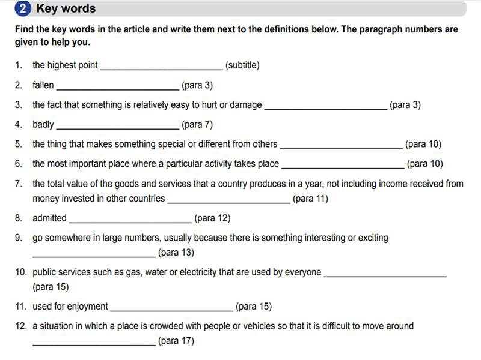
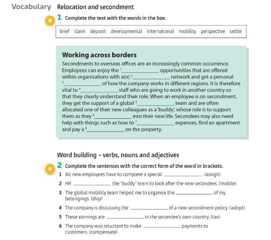
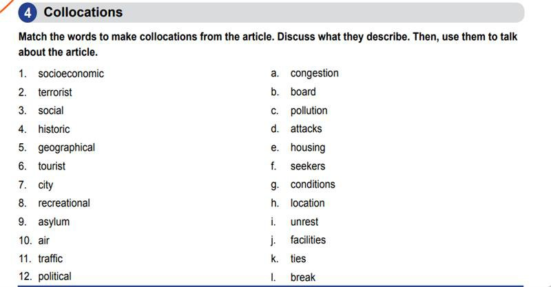

# Assignments  

## English

| Task                                        | Time         | Extra                    | Links  |
| :--------------------------------              | :----------: | :-----------:            | ------:|
| **Which country would you relocate to and why**|**_2 weeks_** |Groups and country of choice to be presented on next class 29/03/2021   | [Click to download pdf](http://bit.ly/English_task)  |
|                         |                      |presentation on 12/4/2021  //  5 minutes long presentation  //  5 slides max|        |
|                                                |              |                                          |        |
|    **_Factors to Consider_**                       |       |
|     _GDP_                                      |
|     _Salary_                                   |
|     _Job Opportunities_                        ||||
|     _Elements connected to the environment_    ||||
|     _Best profesion_                           ||||
|     _House Expenses_                           ||||
|     _Culture_                                  ||||
|                                                ||||
| >> The factors can be found in the pdf          ||||
|                                                ||||
|    **Homework**                                ||||
|    |||
|    |||
|    |||
