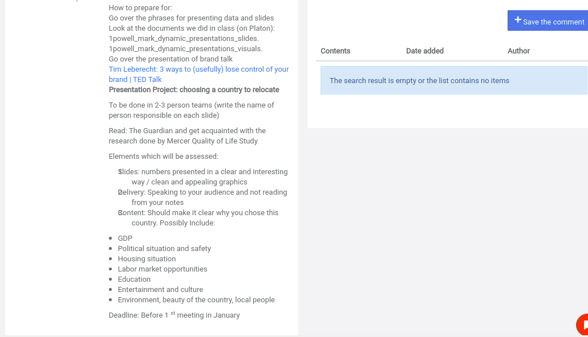
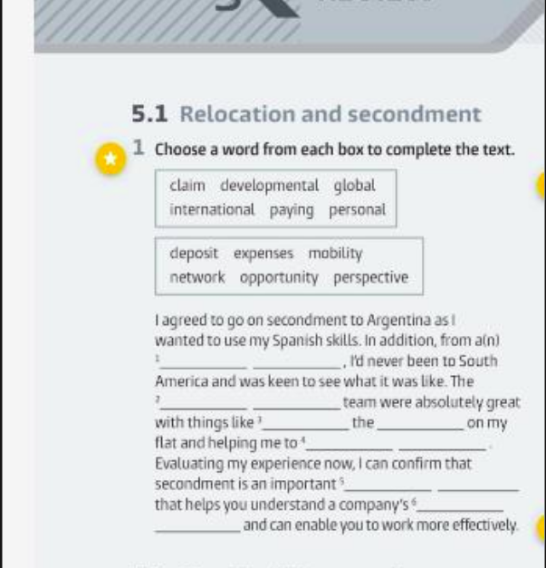
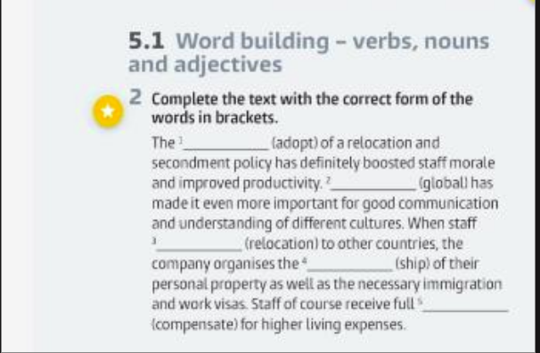

# Assignments  

## English grp a1102      

| Task                                        | Time         | Extra                    | Links  |
| :--------------------------------              | :----------: | :-----------:            | ------:|
| **Which country would you relocate to and why**| |   |  |
|     |                      |  10 minutes long presentation  |        |
|                                                |              |                                          |        |
|    **_Factors to Consider_**                       |       |
|     _GDP_                                      |
|     _Salary_                                   |
|     _Job Opportunities_                        ||||
|     _Elements connected to the environment_    ||||
|     _Best profesion_                           ||||
|     _House Expenses_                           ||||
|     _Culture_                                  ||||
|                                                ||||
| >> The factors can be found in the pdf, kindly use the ones in pdf          |||[Click to download pdf](http://bit.ly/English_task) |
|                                                ||||
|    **Homework**                                ||||
|    |||
|    |||
|    |||

## Manegerial Economics

| **COURSE BOOKS**   | **Download Links** ||
| 1. MN3028_vle1  |[Click_To_Download](http://bit.ly/bookone_)||
| 2. microeconomics_varian  |[Click_To_Download](http://bit.ly/booktwo_)||

## Managing Organizational Crisis

| Task                              | Extra                                                                     | Links    |
| :-------------                    | :----------:                                                              | -----------: |
| 1. **PEST Analysis**           | **THIS APPLYS TO EVERY TASK** [5 people 20 to 18 slides // 2-3 people 15 slides // 1 person 10 slides]    |    |
| 2. **Role of Inventory**               | **Presentation starts on  31/04/2021 and End 05/05/2021**      | | 
| 3. **Ethics in Business** -motivation               |                                                                           | | 
| 4. **Leadership an Leadership Styles**               |                                                                           | | 
| 5. **Characteristics of a business Organization**              |                                                                           | | 
| 6. **Influence of Pandemic on Business**               |                                                                           | | 
| 7. **What Is The Role of Leader In Managing Critical Situation**               |                                                                           | | 
| 8. **Who was Max Webber** - why is he important in managment                |                                                                           | | 
| 9. **Adam Smith** |||
| 10. **What is Need for Changes**|||
| 11. **Henry Fayol**|||
| 12. **Fredrick Taylor**|||
| 13. **Adam Smith**|||
| 14. **Benchmarking/Outsourcing** - What is it, reason, importance|||
| 15. **Need for Changes**  - Reason, Your thoughts |||
| 16. **Characteristic of Organizational Crisis**|||